# Harbor - Ecommerce Dashboard

Harbor is a modern, feature-rich ecommerce dashboard designed to streamline your online business operations. With real-time analytics, intelligent inventory management, and integrated team collaboration tools, Harbor provides everything you need to run and grow your ecommerce business.

---

## Table of Contents

- [Features](#-features)
- [Screenshots](#-screenshots)
- [Key Highlights](#-key-highlights)
- [Technology Stack](#️-technology-stack)

---

## Features

### Analytics Dashboard
Real-time insights into your business performance with:
- Sales metrics and trends
- Revenue tracking
- Customer behavior analytics
- Performance KPIs
- Interactive charts and visualizations
- Tasks overview
- Expenses overview
- Top performing products

### Orders Management
Comprehensive order tracking and management:
- Order status tracking
- Customer information
- Order history and details
- Fulfillment workflow
- Quick search and filtering

### Inventory Overview
Smart inventory management system:
- Real-time stock levels
- Low stock alerts

### Kanban Board with Slack Notifications
Collaborative task management:
- Visual workflow management
- Drag-and-drop interface
- Real-time Slack notifications
- Task assignments and tracking
- Progression overview
- Table view
- Timeline view of tasks with due date

### Margins Calculations
Detailed financial insights:
- Profit margin analysis
- Cost tracking
- Revenue breakdowns
- Return on ad spend -and Profit on ad spend calulations
- AI forecast for next month

---

## 📸 Screenshots

### Landing Page
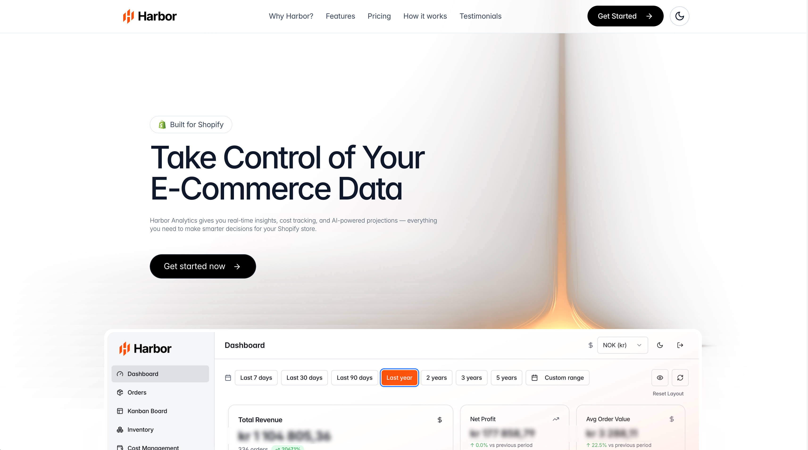
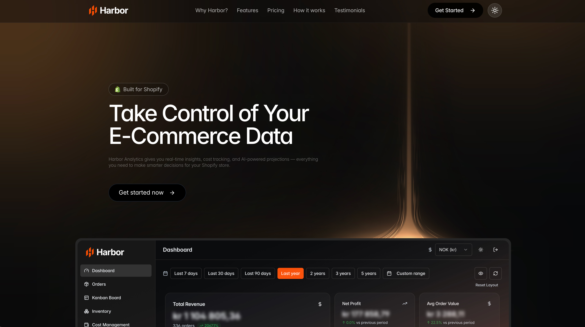
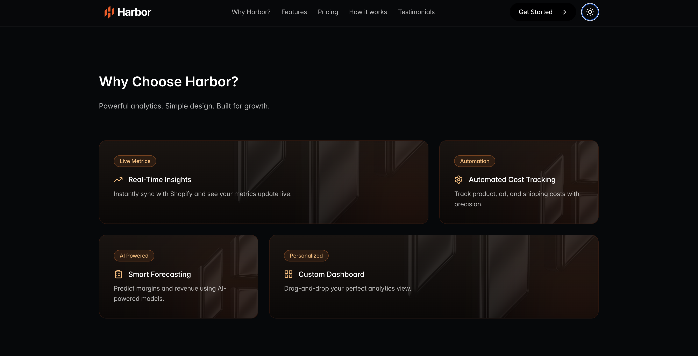
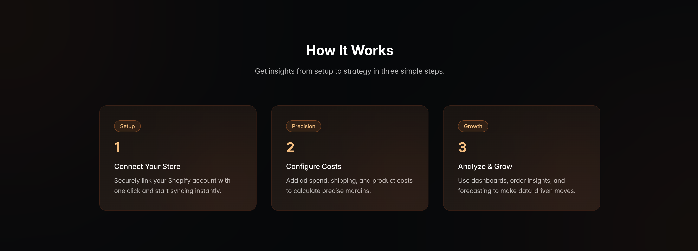
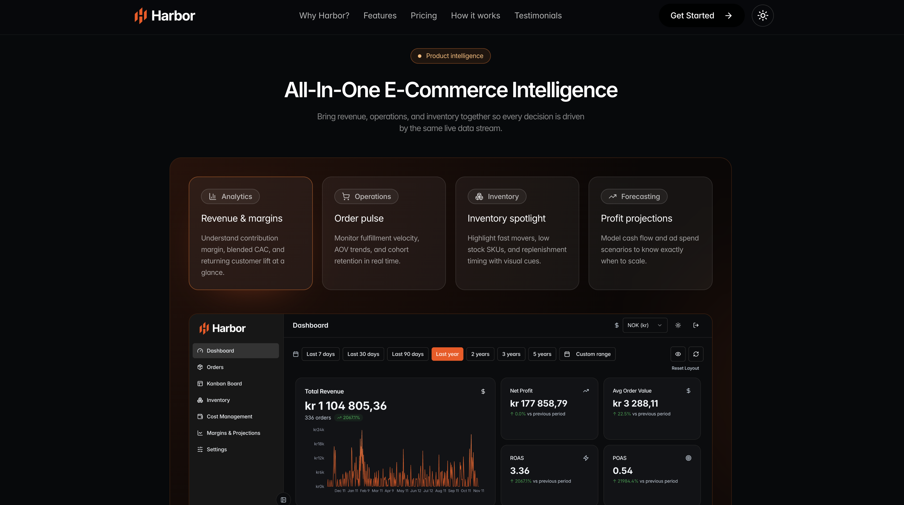
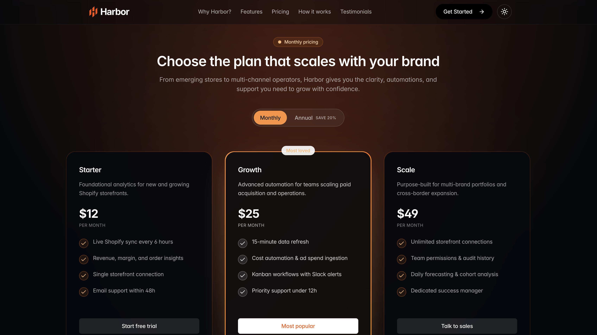
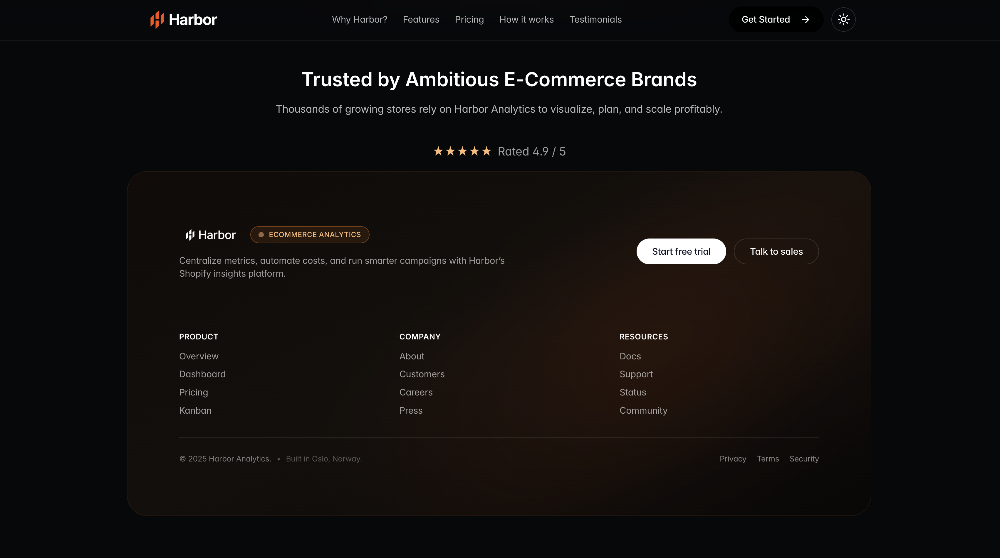

### Dashboard
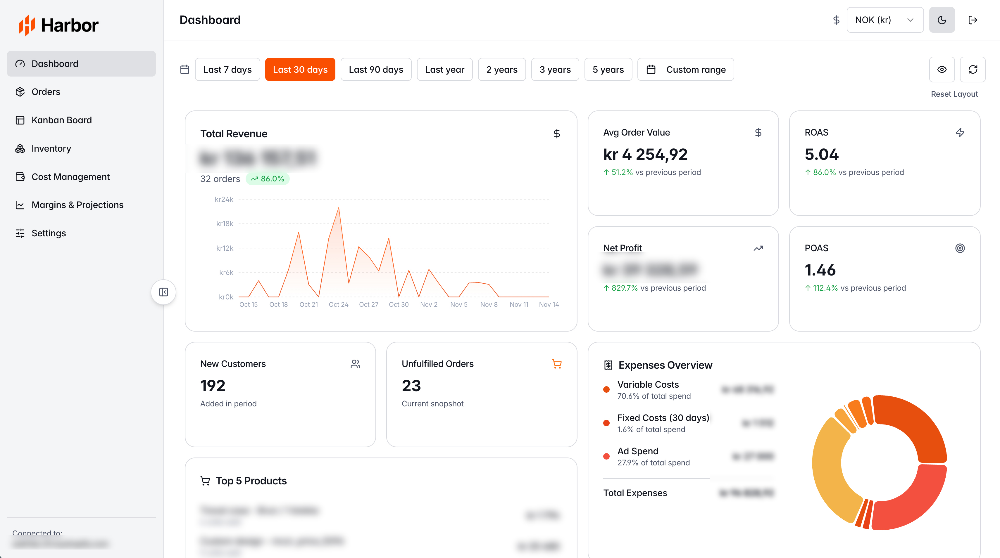

### Orders Management
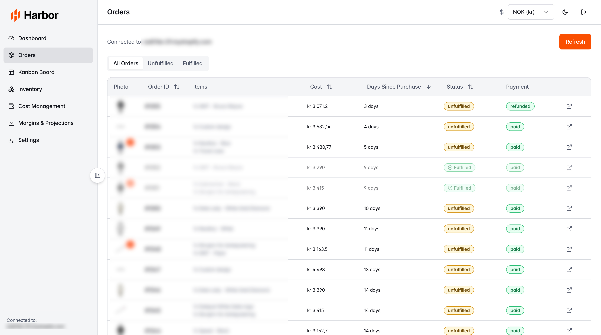

### Inventory Management
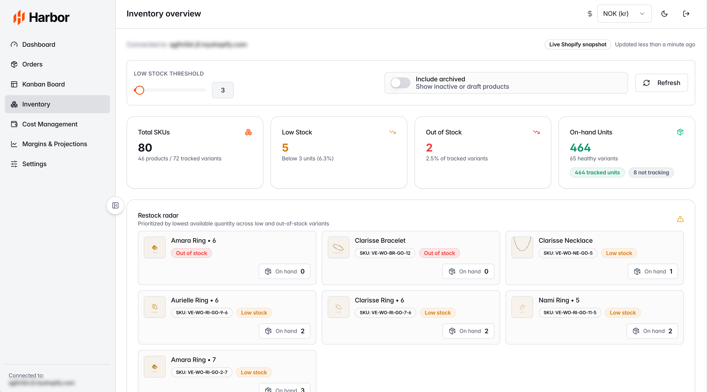

### Kanban Board
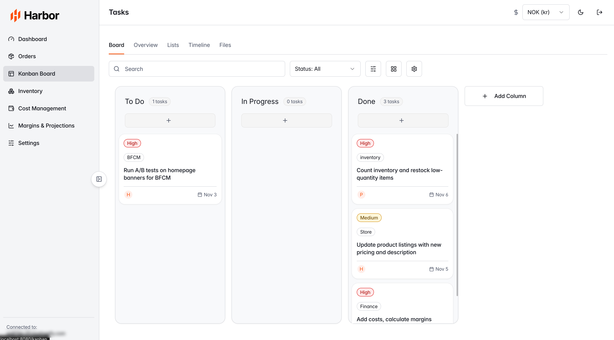
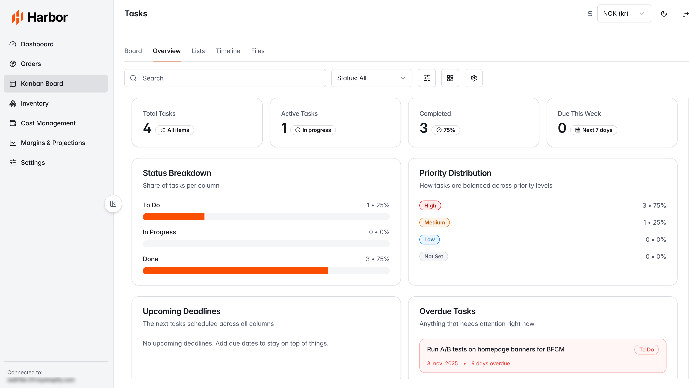
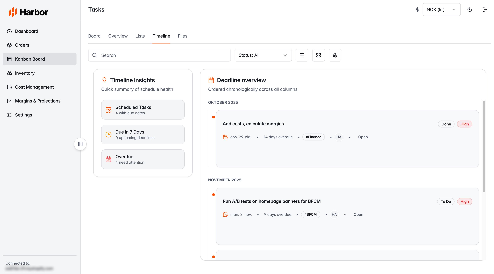
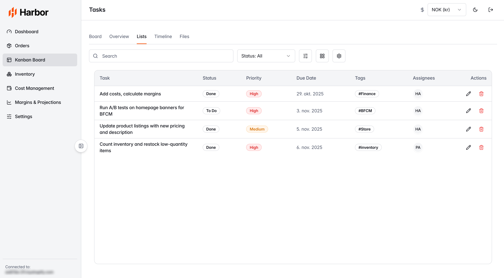

### Margins & Analytics
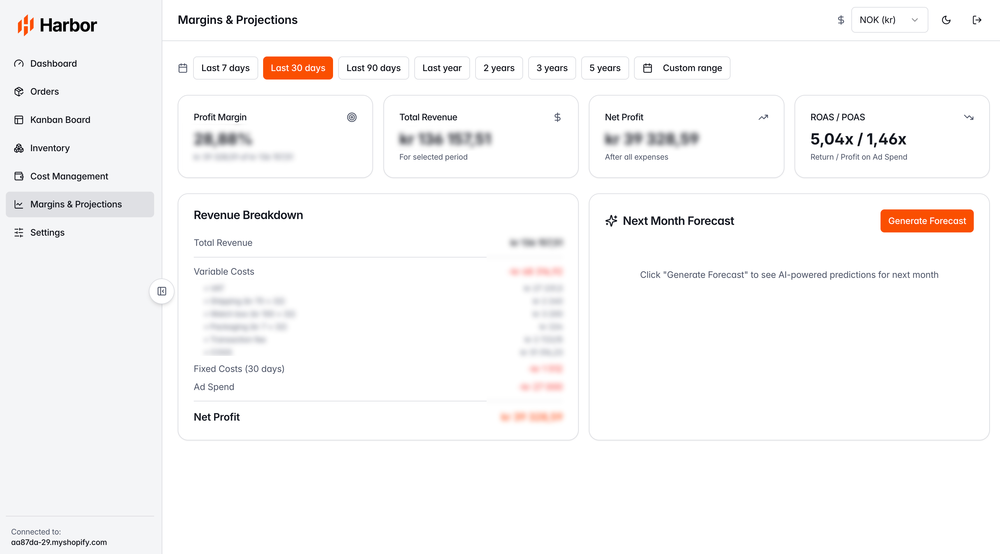

---

## Key Highlights

- **Real-Time Updates**: Stay informed with live data synchronization
- **Slack Integration**: Get instant notifications for critical events
- **Intuitive Interface**: Clean, modern design for effortless navigation
- **Comprehensive Analytics**: Make data-driven decisions with detailed insights
- **Collaborative Tools**: Work seamlessly with your team using kanban boards
- **Financial Intelligence**: Track margins and profitability with precision

---

## Technology Stack

* React
* Typescript 
* Tailwind CSS
* Supabase

